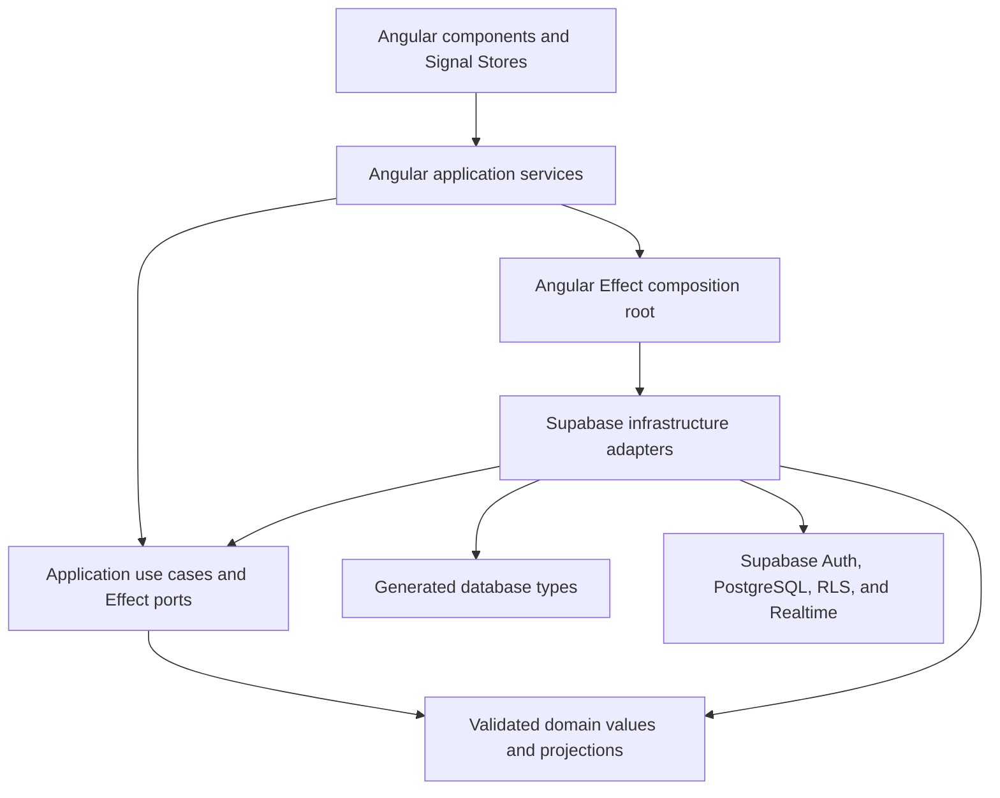

# Collaboration Architecture

> **Document ID:** OMO-ARC-001  
> **Status:** Implemented architecture snapshot  
> **Last verified:** 8 August 2026

## Purpose and scope

This document describes the collaboration system that exists in the repository.
It is an audit of implemented behavior, not a design for future phases. The
current system is a browser-hosted modular application that uses Supabase as its
authentication, persistence, authorization, and realtime platform.

The implemented collaboration baseline includes authentication, profiles,
workspace and channel lifecycle, membership and invitations, persisted
messages, message revision history, archive restoration, keyset pagination,
and selected realtime reconciliation, including advisory workspace presence.
Search and unread tracking remain explicit Phase 2 work.

## Capability map

| Capability     | Implemented behavior                                                                                                           | Primary application boundary | Presentation owner                                                                             |
| -------------- | ------------------------------------------------------------------------------------------------------------------------------ | ---------------------------- | ---------------------------------------------------------------------------------------------- |
| Authentication | Session restoration and observation, sign-in, sign-up, confirmation resend, password recovery, password update, and sign-out   | `AuthenticationService`      | Root-scoped `AuthenticationStore`                                                              |
| Profiles       | Current-profile lookup and editing, exact username lookup, and batched profile enrichment                                      | `ProfileRepository`          | Feature-scoped `CurrentProfileStore`; consuming features retain their own enriched projections |
| Workspaces     | Accessible and archived lists, selection, creation, editing, archive, restoration, and self-service departure                  | `WorkspaceRepository`        | `WorkspaceNavigationStore` plus an independently scoped archived-list store                    |
| Membership     | Owner-first keyset pagination, add, role change, remove, suspend, leave, and capability-driven UI                              | `WorkspaceRepository`        | `WorkspaceMemberDirectoryStore`                                                                |
| Invitations    | Create, list for recipient and owner, accept, decline, and cancel                                                              | `WorkspaceRepository`        | `WorkspaceInvitationsStore`                                                                    |
| Channels       | Active and archived lists, selection, creation, editing, archive, and restoration                                              | `ChannelRepository`          | `ChannelNavigationStore` plus an independently scoped archived-list store                      |
| Messages       | Newest-first keyset pagination, create, edit, soft delete, realtime updates, author enrichment, and immutable revision history | `MessageRepository`          | `ChannelMessagesStore`                                                                         |
| Presence       | Active-workspace private Presence observation and a deduplicated online-member count                                           | `WorkspacePresenceService`   | `WorkspacePresenceStore`                                                                       |
| Typing         | Active-channel start/stop Broadcast events with throttling and expiry                                                          | `ChannelTypingService`       | `ChannelTypingStore`                                                                           |

Workspace administration and invitations currently share one application port.
That reflects their common persistence and authorization boundary; it should be
split only if concrete change pressure shows that the interface has become a
coupling problem.

## Dependency and composition boundaries



The inward dependency rules are:

- Domain libraries contain business values, projections, and invariants. They
  do not depend on Angular, Effect services, Supabase, or generated database
  types.
- Application libraries define use cases, typed failures, and outbound Effect
  ports. They depend on domain policy, not provider implementations.
- Infrastructure libraries implement application ports. They are the boundary
  at which Supabase responses and generated database rows are decoded and
  mapped into application and domain types.
- The Angular application is the composition owner. Its core composition area
  creates the shared Supabase client Layers, supplies all infrastructure
  Layers, and materializes one long-lived `ManagedRuntime`.
- Feature code calls Angular application services. It does not construct
  Effect Layers or access Supabase clients directly.

Nx tags enforce dependencies between projects. The Angular features currently
live inside one client project, so their internal separation is enforced by
feature-local ownership, import aliases, and review rather than by independent
Nx project boundaries. Infrastructure and generated-database imports in the
client are intentionally limited to `app/core` composition and Supabase-client
construction.

## Command and query execution

A normal collaboration operation follows this path:

```text
component event
  -> feature Signal Store
  -> Angular application service
  -> application use case (Effect)
  -> outbound service Tag
  -> Supabase adapter Layer
  -> RLS-protected query or command function
  -> external-data decoder and domain mapping
  -> typed success or expected failure
  -> presentation state update
```

Application use cases build lazy Effect values and do not execute themselves.
Angular application services are the execution boundary: they use the shared
managed runtime and expose promises or interruptible stream subscriptions that
are convenient for Signal Stores. This keeps Effect runtime construction and
provider details out of components while preserving typed application errors.

Signal Stores own asynchronous request state, stale-result protection, and
presentation-specific error messages. Long-lived streams are stopped when the
owning feature is destroyed or its selection scope changes.

## State and navigation ownership

Authentication is application-wide state. All other stores are supplied by the
component that owns their lifetime:

```text
AuthenticationStore (root session)
  -> CurrentProfileStore
  -> WorkspaceNavigationStore (accessible workspaces and selected workspace)
       -> WorkspacePresenceStore
       -> WorkspaceMemberDirectoryStore
       -> WorkspaceInvitationsStore
       -> ArchivedWorkspaceListStore
       -> ChannelNavigationStore (selected workspace's channels and selection)
            -> ArchivedChannelListStore
            -> ChannelTypingStore
            -> ChannelMessagesStore (selected channel's messages and history)
```

Workspace and channel slugs are represented as query parameters on the stable
root route. Query-parameter changes therefore retain the authenticated shell
and its feature stores. Stores resolve those URL values against authoritative,
RLS-visible collections; an inaccessible workspace or archived channel is
removed from both store selection and URL state.

Child features receive selected identities and calculated capabilities from
their owner. They do not infer authorization from display state.

## Persistence and authorization

Supabase PostgreSQL and row-level security remain the authority for ordinary
collaboration operations. Command functions derive the actor from the
authenticated provider session; application command contracts deliberately do
not accept an actor identity that a browser could forge.

Infrastructure adapters must:

- execute only the query or command represented by their application port;
- preserve RLS visibility instead of rebuilding authorization in Angular;
- translate provider failures into the operation's typed error vocabulary;
- validate all returned rows and realtime payloads before they cross inward;
- keep generated database types and Supabase types inside infrastructure or
  the outer client composition boundary.

Workspace, channel, and message lifecycles use stable identities with immutable
versions or revisions and current-head projections. Archive and message-delete
operations preserve history rather than rewriting it. Active and archived
projections are separate domain values so archived data cannot accidentally be
used as active navigation state.

## Realtime ownership

Realtime is capability-specific; there is no generic realtime framework.

| Owner                | Provider source                                       | Scope                           | Reconciliation policy                                                                                        |
| -------------------- | ----------------------------------------------------- | ------------------------------- | ------------------------------------------------------------------------------------------------------------ |
| Authentication       | Supabase Auth session listener                        | Current browser session         | Map provider events into application session changes; observed changes take precedence over stale commands   |
| Workspace navigation | Private Broadcast topic for the authenticated profile | Accessible workspace collection | Treat events as invalidations and reload the authoritative RLS-visible list; clear access that was revoked   |
| Channel navigation   | Private Broadcast topic for one workspace             | Active channel collection       | Treat events as invalidations and reload the authoritative list; clear an archived or inaccessible selection |
| Channel messages     | Channel-filtered Postgres Changes on message heads    | One selected channel            | Validate the changed stable identity, then reconcile the authoritative current message projection            |
| Workspace presence   | Private Supabase Presence topic                       | One selected workspace          | Validate and deduplicate profile keys for advisory display; never use them for authorization                 |
| Channel typing       | Private Supabase Broadcast topic                      | One selected channel            | Validate start/stop events; throttle local starts and expire remote state after missed stops                 |

Workspace and channel streams emit once when their provider subscription is
ready. The subsequent authoritative load closes the query-before-subscribe race.
Every subscription owns its provider listener, and Effect finalizers remove the
listener when the stream is interrupted.

Workspace Presence is client-reported advisory state. Its private-topic RLS
proves that publishers are active workspace members, but a reported Presence
key is not an authorization claim and is never used to derive capabilities.

## Pagination and enrichment

Pagination contracts remain capability-specific:

- messages use a stable `(createdAt, messageId)` cursor for newest-first channel
  history;
- message revisions use immutable version number ordering;
- workspace members use an owner-first `(role, profileId)` cursor with a fixed
  page size of 25.

There is deliberately no generic pagination abstraction. Each cursor encodes a
different business ordering and must remain aligned with its database query.

Profile enrichment is a separate application query. Message and membership
features retain their primary data when a related profile is missing or hidden
by RLS; enrichment does not redefine the authorization of the primary record.

## Validation and failure boundaries

- Browser input is normalized and validated by the owning application use case
  before a repository command is created.
- Provider data is treated as `unknown` at the mapping boundary and decoded
  into domain types.
- Expected failures are tagged application errors carried by Effect. Angular
  services convert execution results into an explicit success/failure value for
  stores.
- Stores map application failures into safe, operation-specific presentation
  messages and retain previous successful state where recovery is possible.
- Request revisions prevent older asynchronous results from replacing state
  produced by a newer selection, command, or realtime event.

## Explicit Phase 2 gaps

The following capabilities are not implemented and must not be inferred from
the existing realtime infrastructure:

- workspace-scoped message search and exact-result navigation;
- per-member read positions, unread counts, and realtime unread reconciliation.

Reactions, threads, attachments, notification delivery, invitation delivery,
and avatar uploads are optional product expansions rather than Phase 2 exit
gates.

The next conservative vertical slice is workspace-scoped message search with
exact-result navigation. Search should begin with its concrete authorization,
ranking, pagination, and navigation behavior rather than a generic search
framework.

## Verification references

- [`eslint.config.mjs`](../../eslint.config.mjs) defines project dependency
  constraints.
- [`apps/client/src/app/core/effect`](../../apps/client/src/app/core/effect)
  owns Effect Layer composition and execution lifetime.
- [`libs/application`](../../libs/application) contains provider-independent
  use cases and ports.
- [`libs/infrastructure`](../../libs/infrastructure) contains Supabase adapters
  and external-data mapping.
- [`supabase/migrations`](../../supabase/migrations) defines persistence,
  commands, RLS, indexes, and realtime behavior.
- [`docs/architecture/code-quality-benchmark.md`](code-quality-benchmark.md)
  defines the review standard for subsequent vertical slices.
