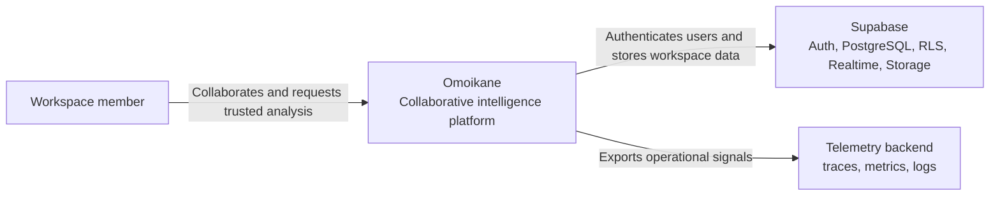
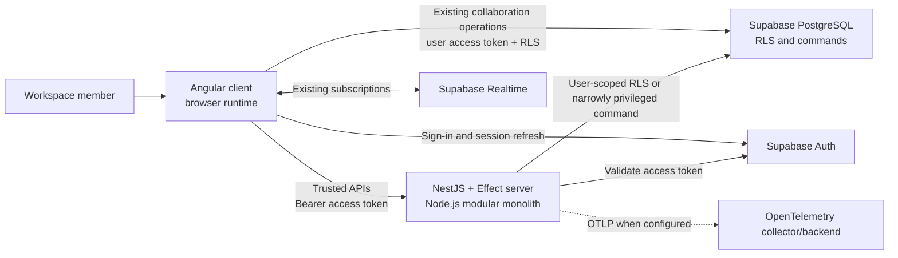
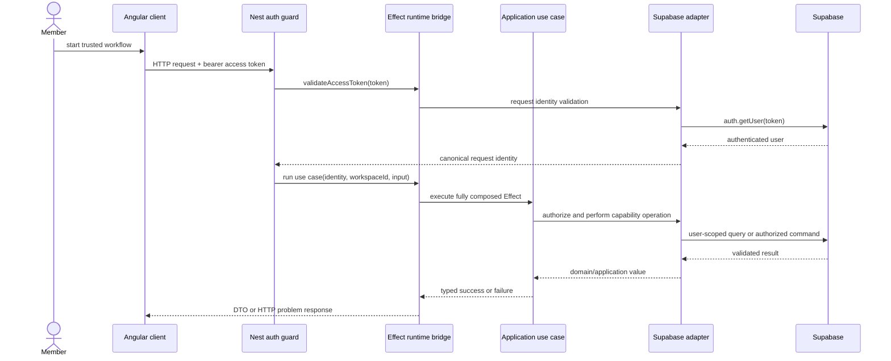

# Modular Server Architecture

> **Document ID:** OMO-ARC-003  
> **Version:** 1.0  
> **Status:** Implemented Phase 3 architecture
> **Date:** 9 August 2026  
> **Product:** Omoikane - The Collaborative Intelligence Platform

## 1. Purpose and scope

This document defines the minimum architecture required to begin Phase 3. It
integrates the existing baseline with ADR-0001 and ADR-0002 so a contributor can
implement the modular server without guessing where NestJS, Effect, Supabase,
authentication, authorization, and HTTP policy belong.

Phase 3 introduces one trusted HTTP runtime for capabilities that cannot or
should not execute directly from the browser. It does not relocate the
implemented collaboration baseline. Authentication, profiles, workspaces,
channels, messages, presence, typing, search, and unread reconciliation continue
to use the existing Angular-to-Supabase path.

The design deliberately does not define the Phase 4 worker, durable job queue,
outbox, AI provider contracts, retrieval model, or a generic contracts package.
Those artifacts are introduced only by the slice that needs them.

## 2. Architectural drivers

- Preserve the direct, RLS-protected collaboration path proven by OMO-ARC-002.
- Add a trusted boundary for privileged and later AI-orchestration workflows.
- Keep business policy independent of NestJS, Fastify, Supabase, and HTTP.
- Reuse the repository's Effect service, Layer, typed-error, and schema
  conventions.
- Authenticate with the existing Supabase identity rather than introducing a
  second session authority.
- Make tenant scope explicit before any privileged operation.
- Start with one process and one deployable server, not internal
  microservices.

## 3. C4 system context



The telemetry backend is a target dependency. Its concrete local stack is
introduced with the first telemetry implementation and is not implied by this
documentation slice.

## 4. C4 container view



The server is an additional boundary, not a replacement gateway. No existing
client repository is redirected through it during Phase 3.

## 5. Runtime and dependency boundaries

The production dependency direction remains:

```text
apps/server (Nest composition and HTTP)
       |
       v
infrastructure -> application -> domain
       |
       v
shared generated database contracts (infrastructure only)
```

### NestJS responsibilities

- construct and stop the process;
- expose Fastify-backed HTTP routes;
- parse configuration before listening;
- apply global authentication and HTTP exception policy;
- publish OpenAPI;
- translate transport input and output;
- own liveness, readiness, request metadata, and HTTP telemetry;
- invoke the shared Effect runtime at the outer boundary.

### Effect responsibilities

- express each use case as `Effect<Success, Failure, Requirements>`;
- retrieve capability-oriented services through Tags;
- compose infrastructure implementations with Layers;
- manage scoped resources and interruption;
- keep expected failures typed until the HTTP boundary;
- attach application spans and structured context to workflows.

### Supabase responsibilities

- remain the authentication authority and system of record;
- enforce RLS for direct client and user-scoped server operations;
- expose transactional commands when authorization and mutation must be atomic;
- provide Realtime and Storage without routing them through NestJS by default.

## 6. Initial module map

Only implemented modules and libraries are created. The map is a placement rule,
not an instruction to scaffold every directory at once.

```text
apps/server/
  src/
    main.ts                       # process bootstrap only
    app/
      server.module.ts            # composition root
      platform/
        configuration/            # startup decoding
        effect-runtime/           # one runtime and lifecycle bridge
        http/                     # problem mapping and request metadata
        health/                   # liveness and readiness transport
        authentication/           # guard and request-context transport
        observability/            # Node/Nest telemetry composition
      analysis-runs/              # Analysis Run controllers and DTOs

libs/domain/analysis/             # introduced with Analysis Run invariants
libs/application/analysis/        # use cases and outbound ports
libs/infrastructure/analysis/     # Supabase adapters and Layers
libs/infrastructure/authentication/ # extended only for server token validation
```

Platform folders are private to `apps/server` until reuse by another real
runtime proves a shared library is necessary. Capability code follows the
existing domain/application/infrastructure split. The app module may compose
capabilities, but capability libraries cannot import the server app.

The first server project uses `project:app` and `runtime:server` tags. Boundary
rules must ensure no domain, application, infrastructure, feature, database, or
utility project depends on `runtime:server`. A `contracts` library is not added
until at least one API contract has a real second compile-time consumer.

## 7. Request execution



The token is transport data and infrastructure input only. The use case receives
a canonical request identity, not the token or a Supabase user object.

## 8. HTTP API conventions

### Routes and versioning

- Business routes use the `/api/v1` prefix.
- Workspace scope is explicit, for example
  `/api/v1/workspaces/{workspaceId}/analysis-runs`.
- Liveness and readiness remain unversioned at `/health/live` and
  `/health/ready` because deployment probes consume them.
- The OpenAPI JSON document is available at `/openapi.json`. An interactive UI
  may be enabled in local development but is not required in production.
- JSON property names use `camelCase`; timestamps use UTC RFC 3339 strings;
  canonical identifiers remain opaque strings at the HTTP boundary and are
  decoded before application execution.

### Input and output

- Transport DTOs describe HTTP serialization only and live in `apps/server`.
- Runtime decoding rejects missing, malformed, unknown, or out-of-range input at
  the boundary. Domain and application validation still own business rules.
- Successful creation returns `201 Created` and a `Location` header when the
  created resource has a stable route.
- Commands that can be retried by clients define idempotency semantics before
  implementation; Phase 3 does not introduce a generic idempotency framework.
- Responses containing authenticated or workspace-scoped data send
  `Cache-Control: private, no-store` unless a route documents a safer policy.

### Problems

All expected HTTP errors use `application/problem+json` following RFC 9457:

```json
{
  "type": "https://omoikane.dev/problems/invalid-request",
  "title": "The request is invalid",
  "status": 400,
  "detail": "One or more request values are invalid.",
  "instance": "/api/v1/workspaces/.../analysis-runs",
  "code": "invalid_request",
  "requestId": "..."
}
```

`type` and `code` are stable machine contracts. `detail` is safe for users but
must not include stack traces, SQL, provider payloads, tokens, secrets, or
message content. Validation problems may add a bounded `errors` collection with
field paths and stable codes. Unexpected defects produce a generic `500`
problem while their diagnostic cause remains only in protected telemetry.

Initial status mapping is:

| Condition                                       | Status | Stable code               |
| ----------------------------------------------- | -----: | ------------------------- |
| malformed request                               |    400 | `invalid_request`         |
| missing or invalid bearer identity              |    401 | `authentication_required` |
| authenticated but operation forbidden           |    403 | `operation_forbidden`     |
| workspace absent or inaccessible                |    404 | `workspace_not_found`     |
| resource state conflicts with requested command |    409 | capability-specific code  |
| provider dependency temporarily unavailable     |    503 | `dependency_unavailable`  |
| unexpected defect                               |    500 | `internal_server_error`   |

Application failures map explicitly by `_tag`; controllers do not infer status
codes from error messages.

## 9. Authentication and authorization

ADR-0002 is authoritative. Operationally, each protected request follows these
steps:

1. Parse exactly one bearer access token from the `Authorization` header.
2. Validate it through the Supabase Auth adapter.
3. Map the result to a canonical request identity.
4. Decode the route's workspace ID.
5. Authorize the use case through a user-scoped RLS query or explicit
   capability port.
6. Acquire privileged infrastructure only inside workflows that require it.

Authentication proves identity; it does not prove workspace access. Nest guards
may establish identity, but workspace authorization remains in the application
workflow because its rules are capability policy and may need transactional
coordination with the command.

## 10. Health and lifecycle contracts

| Endpoint        | Meaning                                                                     | Dependencies                                                 |
| --------------- | --------------------------------------------------------------------------- | ------------------------------------------------------------ |
| `/health/live`  | The process event loop and HTTP adapter can answer.                         | None; never calls Supabase or telemetry backends.            |
| `/health/ready` | The process is initialized and dependencies required by active routes work. | Configuration, Effect runtime, and active critical adapters. |

Liveness returns failure only for an unhealthy process, not for an unavailable
downstream service. Readiness is extended alongside capabilities: the bootstrap
slice checks validated configuration and initialized runtime; the authentication
slice adds a bounded Supabase dependency check. Optional telemetry export does
not make the server unready.

Both endpoints return a small versioned shape containing overall status,
service name, and build version. They expose no configuration values,
credentials, hostnames, stack traces, or detailed provider errors.

Nest shutdown hooks are enabled. On termination the server stops accepting new
traffic, interrupts or drains active Effect work within a bounded grace period,
disposes the Effect runtime, flushes telemetry within a bounded timeout, and
then exits.

## 11. Observability contract

The first runtime emits structured application logs to standard output. The
observability increment adds OpenTelemetry without changing use-case contracts.

This increment is implemented with Fastify request hooks owning the server span
and an Effect/OpenTelemetry bridge owning application and Supabase child spans.
The server span context is passed explicitly into each Effect workflow; request
isolation does not depend on ambient async-local context crossing a fiber
boundary. OTLP/HTTP export is optional and uses a bounded shutdown flush.

Every HTTP request receives or propagates a request ID and trace context. Stable
log fields are:

```text
timestamp level service.name service.version deployment.environment
request.id trace.id span.id http.request.method http.route
http.response.status_code duration_ms error.type workspace.id analysis_run.id
```

Fields are included only when known. Workspace and Analysis Run identifiers are
allowed correlation metadata; access tokens, authorization headers, cookies,
passwords, request bodies, message text, prompts, model output, and raw provider
errors are not logged.

Initial server metrics cover request count, duration, active requests, response
status, authentication failures, and dependency duration/failures. Labels use
bounded route templates and error categories, never user or workspace IDs.
Application spans wrap use cases; infrastructure spans wrap Supabase Auth and
database calls. Trace context later propagates into outbox and worker jobs.

## 12. Phase 3 implementation slices

Phase 3 proceeds in conservative pull requests:

1. **Runtime bootstrap and liveness.** Add the Nx NestJS server project,
   Fastify bootstrap, validated minimum configuration, Effect runtime bridge,
   graceful shutdown, `/health/live`, OpenAPI generation, boundary rules, and
   focused tests. Do not add Supabase authentication or capability modules.
   **Completed.**
2. **Authenticated server boundary.** Add bearer-token validation, immutable
   request identity, deny-by-default guard behavior, readiness, uniform problem
   responses, and integration tests against local Supabase. **Completed.**
3. **Deterministic Analysis Run command.** Introduce only the domain,
   application, database, infrastructure, HTTP, and Angular code required to
   start and observe one workspace-authorized Analysis Run without an LLM or
   worker. Preserve all direct collaboration repositories unchanged.
   **Completed.**
4. **Server telemetry.** Add OpenTelemetry composition and prove one client
   request produces correlated server and Supabase spans. Add the local
   telemetry profile only when this slice consumes it. **Completed:** W3C
   context/request-ID propagation, structured request logs, HTTP/operation
   metrics, correlated Effect and Supabase spans, bounded exporter shutdown,
   and the local Collector/Tempo/Prometheus/Grafana profile.
5. **Server-Sent Events, if required by the implemented Analysis Run UX.** Add
   one status stream after persisted polling behavior is understood; do not
   introduce a generic streaming abstraction first.

The first product-bearing server vertical slice is item 3. Items 1 and 2 are
small runtime prerequisites whose boundaries are independently verifiable.
The current immutable `created` Analysis Run state does not justify a stream;
explicit refresh remains sufficient, so item 5 is deferred until Phase 4 adds
real status transitions.

## 13. Phase 3 acceptance

- The server starts and shuts down deterministically on the supported Node.js
  runtime.
- Liveness and readiness have distinct, tested semantics.
- OpenAPI describes every implemented business route and problem response.
- Protected routes reject invalid credentials uniformly and never log tokens.
- An authenticated member can start the deterministic Analysis Run only in an
  accessible workspace.
- Effect requirements are supplied once by the server runtime composition;
  controllers contain no business orchestration or Supabase queries.
- One request has correlated structured logs and traces.
- The existing authenticated collaboration browser test remains unchanged and
  passes through the direct Angular-to-Supabase path.

## 14. References

- [ADR 0001: NestJS and Effect runtime boundary](adr/0001-nestjs-effect-runtime-boundary.md)
- [ADR 0002: Supabase server authentication and workspace authorization](adr/0002-supabase-server-authentication-and-workspace-authorization.md)
- [NestJS Fastify adapter](https://docs.nestjs.com/techniques/performance)
- [NestJS OpenAPI](https://docs.nestjs.com/openapi/introduction)
- [NestJS authentication guards](https://docs.nestjs.com/security/authentication)
- [NestJS health checks](https://docs.nestjs.com/recipes/terminus)
- [Supabase `auth.getUser`](https://supabase.com/docs/reference/javascript/auth-getuser)
- [RFC 9457 Problem Details for HTTP APIs](https://www.rfc-editor.org/rfc/rfc9457.html)
