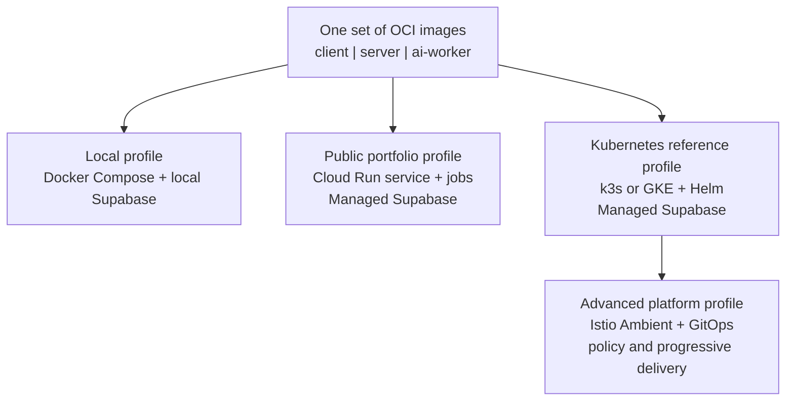

# Deployment and Environment Strategy

> **Document ID:** OMO-OPS-001  
> **Version:** 1.0  
> **Status:** Approved target baseline  
> **Date:** 2 August 2026  
> **Product:** Omoikane - The Collaborative Intelligence Platform

This is a target strategy. Profiles and artifacts are introduced only at their
roadmap gates; documenting a future image or cluster does not authorize
scaffolding it before a vertical slice needs it.

## 1. Deployment principles

- Keep application architecture independent of hosting platform.
- Promote the same OCI images across local, public-cloud, and Kubernetes
  profiles.
- Keep managed Supabase outside the application cluster in hosted environments.
- Do not split the modular monolith into microservices to justify Kubernetes or
  a service mesh.
- Introduce infrastructure complexity only after the preceding profile is
  operational and documented.
- Treat free grants as cost reductions, not guarantees of zero cost; budgets and
  usage alerts are mandatory.

## 2. Profiles

| Profile              | Technology                                                  | Purpose                                                                                |
| -------------------- | ----------------------------------------------------------- | -------------------------------------------------------------------------------------- |
| Local development    | Docker Compose plus Supabase CLI                            | Daily development, integration testing, observability, and optional local AI           |
| Public portfolio     | Google Cloud Run services and jobs plus managed Supabase    | Primary live demonstration with scale-to-zero behavior                                 |
| Kubernetes reference | k3s for a low-cost lab and GKE for managed-cloud validation | Helm, Gateway API, autoscaling, workload identity, and cloud-native operations         |
| Advanced platform    | Kubernetes plus Istio Ambient and GitOps                    | mTLS, workload authorization, traffic policy, progressive delivery, and mesh telemetry |



## 3. Container strategy

- Build three production images when their runtimes exist: `omoikane-client`,
  `omoikane-server`, and `omoikane-ai-worker`.
- Use multi-stage builds, non-root users, read-only root filesystems where
  compatible, explicit health checks, and immutable version tags.
- Publish a semantic version tag, Git commit tag, SBOM, vulnerability scan
  result, and provenance attestation for every release.
- Inject configuration at runtime. Never build environment-specific secrets
  into an image.
- Make the server and worker handle graceful shutdown and stop acquiring work
  before termination.

```text
ghcr.io/izanagi/omoikane-client:<version>
ghcr.io/izanagi/omoikane-server:<version>
ghcr.io/izanagi/omoikane-ai-worker:<version>
```

## 4. Managed Supabase integration

- Supabase Auth issues identity tokens consumed by Angular and validated by the
  server.
- RLS remains the primary authorization control for direct client operations.
- The server and worker receive narrowly scoped privileged credentials only
  where user-scoped access is insufficient.
- Hosted PostgreSQL connections use a connection mode appropriate to the
  runtime. Migrations use a direct connection; scale-to-zero workloads use a
  pooler mode compatible with their transaction behavior.
- pgvector, full-text search, `pg_trgm`, JSONB, materialized views, and
  transactional outbox tables remain in Supabase PostgreSQL until measured scale
  or isolation requirements justify extraction.

## 5. Public portfolio profile: Cloud Run

| Capability                        | Deployment                                                                                                                                |
| --------------------------------- | ----------------------------------------------------------------------------------------------------------------------------------------- |
| Angular client                    | Static web hosting or a small Cloud Run web container                                                                                     |
| Application server                | Cloud Run service with HTTPS, autoscaling, and zero minimum instances for the demo profile                                                |
| AI worker                         | Cloud Run jobs for scheduled or batch work; deploy a continuously polling worker only when latency requirements justify minimum instances |
| Container registry                | Artifact Registry or GitHub Container Registry                                                                                            |
| Secrets                           | Google Secret Manager                                                                                                                     |
| Database, Auth, Storage, Realtime | Managed Supabase                                                                                                                          |
| Observability                     | OpenTelemetry export to the selected hosted or self-managed backend                                                                       |

Cloud Run free usage allowances do not include every possible cost. Artifact
storage, builds, networking, secrets, and AI providers can generate charges.
Use billing budgets, quotas, and scale-to-zero controls.

## 6. Kubernetes reference profile

- Use k3s as the persistent low-cost lab profile on a Linux VM or suitable local
  machine.
- Use GKE Autopilot as the managed Kubernetes validation profile.
- Deploy the client, server, worker, Services, Gateway API routes, ConfigMaps,
  health probes, HorizontalPodAutoscalers, PodDisruptionBudgets, and
  NetworkPolicies through an Omoikane Helm chart.
- Keep managed Supabase external; do not duplicate PostgreSQL in the cluster.
- Deploy Redis in-cluster only for the reference profile. A production profile
  may use managed Redis.

Target structure:

```text
deploy/
  helm/omoikane/
    Chart.yaml
    values.yaml
    templates/
  kubernetes/environments/
    k3s/
    gke/
  gitops/applications/
```

## 7. Advanced profile: Istio Ambient

- Install Istio Ambient only after the Kubernetes baseline passes its acceptance
  tests.
- Enroll the `omoikane` namespace incrementally. Enable Layer 4 mTLS first; add
  Layer 7 waypoint proxies only where authorization or routing policy needs them.
- Use server-to-internal-AI-inference or reranking traffic as the first mesh
  demonstration.
- Demonstrate workload identity, mTLS, authorization policy, canary traffic
  splitting, fault injection, and telemetry correlation.
- Govern external traffic to managed Supabase and hosted AI providers with
  application TLS, egress policy, secrets, and audit logging. The mesh does not
  replace those controls.

The mesh is an infrastructure learning profile, not a prerequisite for business
functionality.

## 8. CI/CD and infrastructure as code

| Stage              | Actions                                                                                                                                                            |
| ------------------ | ------------------------------------------------------------------------------------------------------------------------------------------------------------------ |
| Pull request       | Format, lint, unit tests, architecture-boundary tests, database verification, build existing containers, vulnerability scan, and validate existing Helm/manifests. |
| Main branch        | Publish versioned images and deployment artifacts; update the development environment automatically.                                                               |
| Release tag        | Promote immutable images to the public portfolio environment after approval.                                                                                       |
| Kubernetes profile | Argo CD reconciles Helm releases from Git. GitHub Actions builds artifacts but does not mutate the cluster imperatively.                                           |
| Cloud resources    | OpenTofu or Terraform provisions Cloud Run, registries, secret references, GKE, DNS, budgets, and service accounts.                                                |

Checks apply only after their owned artifacts exist; future-artifact checks are
not Phase 0 or Phase 1 gates.

## 9. Security and observability

- Use separate identities for client, server, worker, CI, and deployment
  automation.
- Give server and worker least-privilege secrets and explicit workspace and
  channel scopes for every AI job.
- Deny network access by default in Kubernetes and allow it through explicit
  NetworkPolicy or mesh authorization.
- Propagate OpenTelemetry trace context across HTTP, job, and database
  boundaries. Include trace and Analysis Run correlation IDs in logs.
- Make readiness probes validate dependencies required to serve traffic. Use
  liveness probes to detect dead processes without dependency-driven restart
  loops.
- Cover application-owned Supabase data with backups, migration recovery
  procedures, and disaster-recovery tests.

## 10. Cost controls and acceptance criteria

- Create cloud billing budgets and alerts before the first deployment.
- Keep Cloud Run minimum instances at zero in the public demo unless measured
  latency justifies a controlled exception.
- Enforce AI provider quotas and per-analysis limits in the application.
- Shut down or delete unused Kubernetes clusters; keep k3s as the default
  persistent reference environment.
- Use load tests to determine the smallest resource requests that satisfy
  service-level objectives.

| Profile    | Exit criterion                                                                                                                       |
| ---------- | ------------------------------------------------------------------------------------------------------------------------------------ |
| Local      | A release image set starts through Docker Compose and passes smoke tests against local Supabase.                                     |
| Cloud Run  | The public demo deploys immutable images, authenticates through managed Supabase, executes one AI job, and scales to zero when idle. |
| Kubernetes | The Helm chart installs on k3s and GKE, passes probes, scales server and worker independently, and exports telemetry.                |
| Mesh       | mTLS and explicit authorization protect a documented internal service path; canary and fault-injection exercises are reproducible.   |

## 11. Official references

- [Cloud Run pricing](https://cloud.google.com/run/pricing)
- [Cloud Run overview](https://docs.cloud.google.com/run/docs/overview/what-is-cloud-run)
- [Supabase database connections](https://supabase.com/docs/guides/database/connecting-to-postgres)
- [GKE pricing](https://cloud.google.com/kubernetes-engine/pricing)
- [GKE Autopilot overview](https://docs.cloud.google.com/kubernetes-engine/docs/concepts/autopilot-overview)
- [k3s documentation](https://docs.k3s.io/)
- [Istio data plane modes](https://istio.io/latest/docs/overview/dataplane-modes/)
- [Istio Ambient getting started](https://istio.io/latest/docs/ambient/getting-started/)
