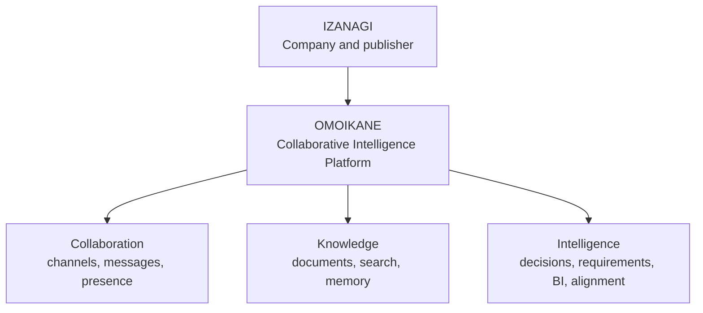

# Rebranding Implementation Plan

> **Document ID:** OMO-BRD-001  
> **Version:** 1.0  
> **Status:** Approved baseline, repository-reconciled 8 August 2026  
> **Date:** 2 August 2026  
> **Transition:** Chat Hub 99 to Omoikane

## 1. Approved brand

| Element               | Approved value                          |
| --------------------- | --------------------------------------- |
| Company               | Izanagi                                 |
| Product               | Omoikane                                |
| Category              | Collaborative Intelligence Platform     |
| Tagline               | The Collaborative Intelligence Platform |
| Repository            | `omoikane`                              |
| Primary package scope | `@omoikane/*`                           |
| Container namespace   | `ghcr.io/izanagi/omoikane-*`            |

Omoikane is a platform for collaboration, organizational knowledge, and
business intelligence. Channels and messaging remain the first implemented
capability and belong to the Collaboration bounded context.



## 2. Scope and non-goals

### 2.1 In scope

- Product names, repository metadata, package metadata, UI text, icons,
  documentation, container names, runtime identifiers, telemetry service names,
  and deployment resources.
- Transition from chat-centric product language to collaboration-centric
  language.
- A durable terminology standard for future features and bounded contexts.
- A migration sequence that preserves working builds and reviewable pull
  requests.

### 2.2 Explicit non-goals

- Do not redesign the database as part of the brand change.
- Do not rewrite existing migration files or Git history.
- Do not rename domain tables merely to reflect the new product name. The
  current repository already uses `channels`; the source baseline's transitional
  instruction to retain a `rooms` table does not apply to this schema.
- Treat the detailed logo system, illustration language, and marketing website
  as separate design deliverables. The initial implementation uses a clean
  Omoikane wordmark and the existing neutral design system.

## 3. Terminology standard

| Legacy term      | Approved term                       | Application                                            |
| ---------------- | ----------------------------------- | ------------------------------------------------------ |
| Chat Hub 99      | Omoikane                            | All active product surfaces and documentation          |
| chat application | collaborative intelligence platform | Product positioning                                    |
| chat feature     | channels and messaging              | Capability descriptions                                |
| room             | channel                             | UI, domain, application, and current database language |
| chat history     | conversation history                | User-facing copy                                       |
| chat analytics   | conversation intelligence           | AI and BI capabilities                                 |
| bot              | assistant                           | User-facing AI capability                              |
| AI result        | analysis finding                    | Auditable derived output                               |

Historical references may retain their original language when changing them
would falsify history. Active documentation uses the approved terms.

## 4. Technical naming standard

| Area                           | Standard                                                                       |
| ------------------------------ | ------------------------------------------------------------------------------ |
| Root package                   | `omoikane`                                                                     |
| npm workspace packages         | `@omoikane/<capability>`                                                       |
| Nx workspace name              | `omoikane`                                                                     |
| Docker Compose project         | `omoikane`                                                                     |
| Supabase local project ID      | `omoikane-local`                                                               |
| OCI images                     | `ghcr.io/izanagi/omoikane-client`, `omoikane-server`, and `omoikane-ai-worker` |
| Telemetry service names        | `omoikane-client`, `omoikane-server`, and `omoikane-ai-worker`                 |
| Application environment prefix | `OMOIKANE_`                                                                    |
| Supabase environment variables | Retain standard `SUPABASE_` names                                              |
| Kubernetes namespace           | `omoikane`                                                                     |
| Cloud resources                | `omoikane-<environment>-<resource>`                                            |

Migration filenames, released artifacts, Git commits, and database audit records
keep their historical names. Active product surfaces are renamed; history is
not rewritten. The hosted Supabase project URL is an external resource identity
and requires an explicit migration decision rather than a mechanical text
replacement.

## 5. Implementation sequence

| Pull request | Focus                                | Outcome                                                                                                                                                                 |
| ------------ | ------------------------------------ | ----------------------------------------------------------------------------------------------------------------------------------------------------------------------- |
| PR 1         | Decision and documentation baseline  | Add approved terminology, plans, architecture references, and repository reconciliation notes. No code changes.                                                         |
| PR 2         | Repository and workspace identity    | Rename repository metadata, root package, README, Nx workspace labels, issue templates, and developer scripts.                                                          |
| PR 3         | Product shell and UI copy            | Replace visible names, page titles, navigation labels, metadata, favicons, and accessibility labels. Introduce the Omoikane wordmark.                                   |
| PR 4         | Runtime and observability identity   | Rename Docker Compose project, container images, log fields, OpenTelemetry service names, Supabase local project ID, and environment prefixes that exist at that point. |
| PR 5         | Package and import namespace         | Move reusable package names to `@omoikane/*`. Keep internal relative imports according to repository policy.                                                            |
| PR 6         | Deployment resource identity         | Rename cloud services, Kubernetes objects, Helm chart metadata, GitHub environments, dashboards, and CI artifacts that exist at that point.                             |
| PR 7         | Legacy-name removal and verification | Run repository-wide checks, preserve only documented historical references, and complete acceptance tests.                                                              |

Do not create future runtime or deployment artifacts merely to rename them. A
PR applies its naming rule to artifacts that exist when the PR is implemented;
later slices create new artifacts with the Omoikane identity from the start.

## 6. Detailed migration checklist

| Area                 | Required changes                                                                                                                                                          |
| -------------------- | ------------------------------------------------------------------------------------------------------------------------------------------------------------------------- |
| Repository           | Repository name, description, topics, default branch protection, README badges, contribution links, issue templates, and pull request template.                           |
| Workspace            | Root `package.json`, generated lockfile metadata, `nx.json`, project descriptions, package scopes, code owners, and development commands.                                 |
| Angular client       | Document title, application shell, navigation, sign-in copy, empty states, error messages, PWA manifest, icons, and Open Graph metadata.                                  |
| Server and worker    | Application names, logs, health payloads, OpenAPI title, user-agent strings, metric names, and trace resource attributes when those runtimes exist.                       |
| Supabase             | Local `project_id`, seed labels, email templates, Storage bucket display names, and product-branded Realtime channel prefixes. Handle hosted project identity separately. |
| Database             | Rename only objects containing product branding. Do not rename domain tables merely to match the new brand.                                                               |
| Containers           | Image repository, labels, Compose project, container names, health-check descriptions, SBOM, and provenance metadata when container artifacts exist.                      |
| Cloud and Kubernetes | Service names, namespaces, Helm chart, ConfigMaps, dashboards, alert labels, and GitOps application names when deployment artifacts exist.                                |
| Documentation        | Architecture diagrams, glossary, screenshots, example commands, package comments, and TSDoc product references.                                                           |

## 7. Acceptance criteria

- A case-insensitive repository search finds no active `chat hub 99`,
  `chat-hub-99`, or equivalent legacy product identifiers outside an approved
  historical-reference allow-list.
- The application presents Omoikane consistently in the browser title, shell,
  authentication screens, error pages, manifests, and metadata.
- Builds, tests, lint checks, database verification, and end-to-end smoke tests
  pass after each pull request.
- Existing and future container images and telemetry identify their runtimes as
  Omoikane services.
- Existing database migrations apply from an empty database without
  modification.
- The root README explains Izanagi, Omoikane, and the collaborative intelligence
  positioning in its first screenful.
- Rebranding does not change authorization, message semantics, or persistence
  behavior.

Representative verification commands:

```powershell
pnpm format:check
pnpm lint
pnpm test
pnpm build
pnpm db:verify
rg -i "chat[ _-]?hub[ _-]?99|chat hub 99" . --glob '!docs/history/**' --glob '!CHANGELOG.md'
```

Run only commands exposed by the repository at the point of each PR; adding a
missing quality command is scoped to the phase that owns that quality gate.

## 8. Risks and rollback

| Risk                                           | Control                                                                                                                        |
| ---------------------------------------------- | ------------------------------------------------------------------------------------------------------------------------------ |
| Broken imports after package renames           | Perform namespace changes in a dedicated PR; run TypeScript and Nx graph checks before merge.                                  |
| Cloud resources cannot be renamed in place     | Create the Omoikane resource, migrate traffic, and remove the legacy resource only after verification.                         |
| Historical links break after repository rename | Enable repository redirects and update badges and documentation links in the same PR.                                          |
| A branding change alters database behavior     | Database domain-object renames are excluded. Any future data-model migration requires its own decision and compatibility plan. |
